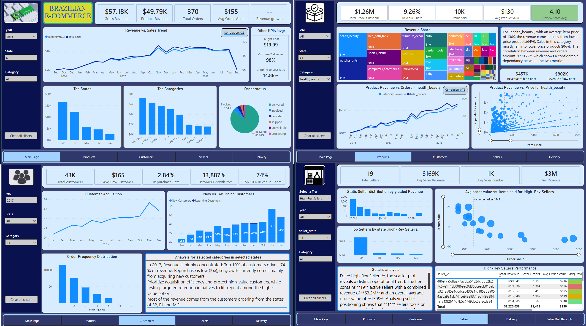

# Brazilian E-Commerce Marketplace Analysis

## Overview

This project analyzes operational and commercial performance across the Olist Brazilian e-commerce marketplace using SQL, Python, Power BI, and DAX.

The analysis focuses on:
- customer purchasing behavior,
- seller performance,
- delivery operations,
- freight efficiency,
- and revenue distribution patterns.

## Dashboard Preview

### Main Performance


## Dataset

Source dataset:
[Kaggle Dataset](https://www.kaggle.com/datasets/olistbr/brazilian-ecommerce)

The raw dataset files are not included in this repository due to file size limitations.

## Project Workflow
### Stage 1 : Data Exploration
The dataset contains nine tables describing different aspects of marketplace operations, including customers, orders, sellers, products, payments, reviews, and geolocation data.
Initial exploration focused on:
-	Understanding table relationships
-	Identifying primary and foreign keys
-	Inspecting data completeness
-	Checking timestamp consistency across operational events
Key entities identified during exploration:
-	Orders
-	Order Items
-	Customers
-	Sellers
-	Products
-	Payments
-	Reviews
-	Delivery timestamps
-	Geolocation information
This stage established the logical structure of the dataset and informed the analytical design of the project.
________________________________________
### Stage 2 : Data Cleaning & Validation
Initial cleaning and validation were performed using Python to ensure dataset integrity before modeling.
Key steps included:
-	Identifying missing values across operational timestamps
-	Validating order relationships between tables
-	Checking consistency between order-level and order-item-level data
-	Verifying delivery timestamps and purchase timestamps
-	Confirming key uniqueness and join compatibility
This step ensured the dataset could support reliable analytical modeling.
________________________________________
### Stage 3 : Data Modeling Design
A star schema approach was implemented to support efficient analytical queries and Power BI performance.
Fact Table
fact_sales
-	Fact_id
-	order_id
-	order_item_id
-	product_id
-	seller_id
-	customer_id
-	date_key
-	price
-	freight_value
-	total_value
-	review_score
-	price (bins)
-	total_value (bins)
Dimension Tables
-	dim_customers
-	dim_sellers
-	dim_products
-	dim_date
-	dim_orders
-	dim_state
-	Seller Revenue Summary
-	dim_delivery
Helping Tables
-	Seller Tier
-	Customer Order Counts
Delivery and Seller performance metrics were maintained at the order level, while product category information exists at the order-item level. This difference in grain required careful handling during metric calculations.
The star schema structure allows efficient filtering across multiple analytical dimensions.
________________________________________
### Stage 4 : Feature Engineering
Additional analytical features were derived to support business insights.
Examples include but not limited to:
-	Freight-to-revenue ratio
-	Seller revenue tiers
-	Customer repurchase rate
-	Delivery delay classifications
-	Distribution bins
These features enabled deeper analysis of marketplace performance.
________________________________________
### Stage 5 : Power BI Data Model
The cleaned dataset was imported into Power BI and structured using a star schema model.
Key modeling decisions included:
-	A dedicated date dimension for time-based analysis
-	Controlled cross-filter directions to avoid ambiguous relationships
-	Use of inactive relationships where multiple time paths existed
-	Ensuring correct filter propagation across fact and dimension tables
Special care was required to handle grain mismatches between order-level delivery metrics and order-item-level product attributes.
________________________________________
### Stage 6 : DAX Metrics & Analytical Logic
A range of DAX measures were implemented to support business analysis. They are grouped as page x measures.
Examples include:
-	Total Revenue
-	Freight-to-Revenue Ratio
-	Repurchase Rate
-	Seller Revenue Segmentation
-	Delivery Delay Metrics
Delivery Outlier Detection
Delivery anomalies were identified using the Tukey IQR method:
Upper Bound = Q3 + 1.5 * IQR
Orders exceeding this threshold were flagged as abnormal deliveries and categorized by severity level. This allows operational teams to quickly identify logistics issues.
A more detailed info is available from  
________________________________________
### Stage 7 : Dashboard Design
The final Power BI dashboard is organized into six analytical pages:
Main
-	Overall performance
-	Slicers to segment the data
Products
-	Category performance
-	Revenue distribution
-	Price and freight relationships
Customers
-	Repurchase rate analysis
-	Revenue concentration
-	Customer purchasing patterns
Sellers
-	Seller revenue segmentation
-	Marketplace seller distribution
-	Seller performance comparisons
Delivery Performance
-	Delivery time analysis
-	Outlier detection
-	Operational logistics monitoring
Seller drill through page
-	Detailed info on selected seller from the Sellers page
The dashboard supports interactive filtering across:
-	Time
-	Geography
-	Product categories
-	Seller segments
This structure allows stakeholders to explore performance across multiple dimensions.
________________________________________
## Key Insights
Revenue Concentration
A small percentage of customers generate a large share of marketplace revenue, highlighting the importance of customer retention strategies.
Customers number of purchases distribution
Most of the customers in the data set are one-timers only. A repurchase rate of approximately 3% supports this fact.
Seller Performance Variability
Seller revenue distribution shows significant variance across marketplace participants, supporting the use of tiered seller segmentation.
Freight Cost Impact
Freight costs vary substantially across regions and categories. The freight-to-revenue ratio provides a more reliable comparison metric than simple freight averages.
Delivery Outliers
A small subset of orders experiences significantly longer delivery times, which can distort average delivery metrics. Identifying these outliers helps isolate potential logistics failures.
________________________________________
## Repository Structure
```
project-root
│
├── 01_clean_data
│   ├── 01_data_check
│   └── (9 clean Olist csv files)
│
├── 02_sql_modeling
│   └── 01_sql_scripts
│
├── 03_powerbi
│   └── powerbi_dashboard.pbix
│
├── 04_media
│   └── (7 .png files)
│
└── README.md
```
________________________________________
## Future Improvements
Potential extensions for this analysis include:
-	Customer cohort analysis
-	Customer lifetime value modeling
-	Geographic delivery performance optimization
-	Seller retention and churn analysis

